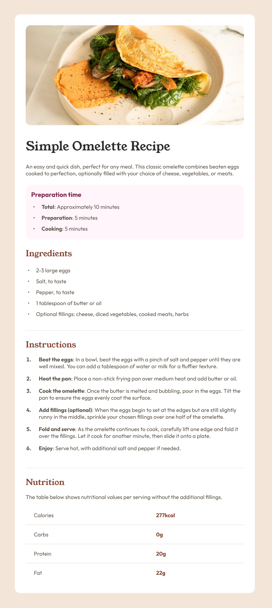

# Frontend Mentor - Recipe page solution

This is a solution to the [Recipe page challenge on Frontend Mentor](https://www.frontendmentor.io/challenges/recipe-page-KiTsR8QQKm). Frontend Mentor challenges help you improve your coding skills by building realistic projects. 

## Table of contents

- [Overview](#overview)
  - [The challenge](#the-challenge)
  - [Screenshot](#screenshot)
  - [Links](#links)
- [My process](#my-process)
  - [Built with](#built-with)
  - [Useful resources](#useful-resources)
- [Author](#author)
- [Acknowledgments](#acknowledgments)

**Note: Delete this note and update the table of contents based on what sections you keep.**

## Overview

### Screenshot

### Links

- [Solution URL]()
- [Live Site URL](https://yemima20.github.io/recipe-page/)

## My process

### Built with

- Semantic HTML5 markup
- CSS custom properties, pseudo-classes & function
- Flexbox
- Mobile-first workflow

### Useful resources

- [Marker](https://developer.mozilla.org/en-US/docs/Web/CSS/::marker) : styling marker.
- [Table](https://developer.mozilla.org/en-US/docs/Learn_web_development/Core/Styling_basics/Tables) : styling table.

## Author

- Frontend Mentor - [@Yemima20](https://www.frontendmentor.io/profile/Yemima20)